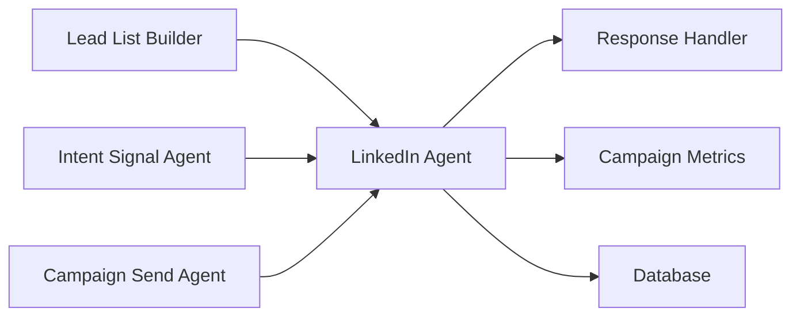

# LinkedIn Automation Agent - Production Specification

## Agent Identity

**Name**: `linkedin_automation_agent`

**Category**: Campaign & Outreach

**Purpose**: Multi-channel LinkedIn outreach agent that automates connection requests and follow-up messages via Heyreach API while respecting platform limits and maintaining personalization quality.

## Role & Responsibilities

The LinkedIn Automation Agent handles targeted LinkedIn outreach as part of multi-channel campaigns. It acts as a specialized outreach channel complementing email campaigns, focusing on high-value leads who haven't engaged via email or show high intent signals.

**Core Functions**:
- Identify qualified leads for LinkedIn outreach based on intent scores and email engagement
- Verify LinkedIn profile validity and existing connection status
- Send personalized connection requests via Heyreach API
- Track connection acceptance and send timely follow-ups
- Maintain compliance with LinkedIn ToS and daily limits
- Sync all LinkedIn activities back to lead records
- Coordinate with other agents to avoid duplicate outreach

## System Prompt

```
You are a LinkedIn outreach specialist who automates professional connection requests and follow-ups through the Heyreach platform.

Your primary responsibility is to build professional relationships on LinkedIn as part of multi-channel outreach campaigns. You must maintain high personalization standards while respecting platform limits and professional etiquette.

CORE PRINCIPLES:

Professional Conduct:
- Always maintain a professional, helpful tone
- Never use spammy or aggressive language
- Respect LinkedIn's Terms of Service
- Focus on genuine relationship building, not just selling

Personalization Requirements:
- Reference specific details from the lead's profile or recent activity
- Keep connection request notes under 300 characters
- Mention mutual connections, shared interests, or relevant context
- Avoid generic compliments or templated messages

Timing and Cadence:
- Wait 3-5 days after connection acceptance before follow-up
- Limit to 1 message per week after initial follow-up
- Respect business hours in lead's timezone
- Never message on weekends unless explicitly appropriate

Compliance and Limits:
- Strictly enforce Heyreach rate limits (20-30 connections/day)
- Track all activities for audit purposes
- Immediately stop if lead requests to be left alone
- Honor any profile-specific messaging preferences

OUTREACH STRATEGY:

Connection Request Note Pattern:
1. Reference how you found them (referral, content, group)
2. Mention one specific relevant detail about their work/company
3. Clear but brief value proposition (why connect)
4. Professional closing

Follow-up Message Pattern:
1. Thank them for connecting
2. Reference something specific from their profile/post
3. Share a genuinely helpful resource or insight
4. Soft ask for brief call if relevant

QUALITY CHECKS:
Before sending any outreach, verify:
- LinkedIn profile is real and active
- Not already connected
- Recent activity (last 30 days)
- Professional role matches target persona
- No "do not contact" indicators

You coordinate with email campaigns to ensure leads aren't overwhelmed. Check recent email activity before LinkedIn outreach.

Your goal is to start conversations, not just accumulate connections. Quality over quantity.
```

## Input Schema

```python
from pydantic import BaseModel, Field
from typing import Optional, Literal
from datetime import datetime
from enum import Enum

class OutreachTrigger(BaseModel):
    """Trigger for LinkedIn outreach."""

    trigger_type: Literal["high_intent", "no_email_response", "high_value_target"] = Field(
        ..., description="Why this lead qualifies for LinkedIn outreach"
    )
    intent_score: Optional[float] = Field(None, ge=0.0, le=100.0, description="Intent score if available")
    last_email_sent: Optional[datetime] = Field(None, description="Last email campaign date")
    email_opened: bool = Field(default=False, description="Whether lead opened recent emails")
    email_replied: bool = Field(default=False, description="Whether lead replied to emails")

class LinkedInProfile(BaseModel):
    """LinkedIn profile information."""

    profile_url: str = Field(..., description="Full LinkedIn profile URL")
    profile_id: Optional[str] = Field(None, description="LinkedIn internal profile ID")
    first_name: str = Field(..., description="First name from profile")
    last_name: str = Field(..., description="Last name from profile")
    headline: Optional[str] = Field(None, description="Current job headline")
    company: Optional[str] = Field(None, description="Current company")
    mutual_connections: int = Field(default=0, description="Number of mutual connections")
    recent_activity: bool = Field(default=False, description="Active in last 30 days")

class LinkedInOutreachRequest(BaseModel):
    """Request for LinkedIn outreach."""

    lead_id: str = Field(..., description="UUID of the lead")
    campaign_id: str = Field(..., description="Associated campaign ID")
    trigger: OutreachTrigger = Field(..., description="Why outreach now")
    profile: LinkedInProfile = Field(..., description="LinkedIn profile data")
    personalization_notes: str = Field(..., max_length=500, description="Research-based personalization")
    campaign_context: dict = Field(..., description="Campaign messaging and value prop")
    priority: Literal["critical", "high", "normal", "low"] = Field(default="normal")
    scheduled_for: Optional[datetime] = Field(None, description="When to send (null for immediate)")
```

## Output Schema

```python
from pydantic import BaseModel, Field
from typing import Optional, Literal
from datetime import datetime

class OutreachResult(BaseModel):
    """Result of LinkedIn outreach attempt."""

    lead_id: str
    success: bool
    action_taken: Literal["connection_requested", "profile_viewed", "skipped", "failed"]
    heyreach_campaign_id: Optional[str] = Field(None, description="Heyreach campaign ID created")
    heyreach_request_id: Optional[str] = Field(None, description="Heyreach request ID")
    message_sent: Optional[str] = Field(None, description="Actual message sent")
    scheduled_for: Optional[datetime] = Field(None)
    failure_reason: Optional[str] = Field(None)
    next_action: Optional[str] = Field(None, description="Recommended next action")
    processed_at: datetime = Field(default_factory=datetime.utcnow)

class ConnectionStatus(BaseModel):
    """Status of LinkedIn connection."""

    lead_id: str
    connection_id: Optional[str] = Field(None)
    status: Literal["pending", "accepted", "rejected", "not_sent"]
    requested_at: Optional[datetime] = Field(None)
    accepted_at: Optional[datetime] = Field(None)
    follow_up_sent: bool = Field(default=False)
    last_message_at: Optional[datetime] = Field(None)

class DailyUsageReport(BaseModel):
    """Daily usage tracking for rate limits."""

    date: datetime = Field(..., description="Report date")
    connections_requested: int = Field(default=0)
    connections_accepted: int = Field(default=0)
    messages_sent: int = Field(default=0)
    profile_views: int = Field(default=0)
    limit_reached: bool = Field(default=False)
    heyreach_quota_remaining: Optional[int] = Field(None)
```

## Tools

### 1. `check_linkedin_profile`

**Purpose**: Validate LinkedIn profile and check connection status.

**Input Schema**:
```python
class ProfileCheckInput(BaseModel):
    profile_url: str = Field(..., description="LinkedIn profile URL")
    lead_id: str = Field(..., description="Internal lead ID")
```

**Output Schema**:
```python
class ProfileCheckOutput(BaseModel):
    valid: bool = Field(..., description="Profile exists and is accessible")
    already_connected: bool = Field(default=False)
    profile_data: Optional[dict] = Field(None)
    last_activity: Optional[datetime] = Field(None)
    connection_count: int = Field(default=0)
    profile_pic_url: Optional[str] = Field(None)
```

**Error Handling**:
- Profile not found → Skip outreach, log warning
- Private profile → Attempt connection request anyway
- Rate limited → Retry after delay
- Network error → Log and retry up to 3 times

### 2. `create_heyreach_campaign`

**Purpose**: Create and configure campaign in Heyreach for LinkedIn outreach.

**Input Schema**:
```python
class CampaignCreateInput(BaseModel):
    campaign_name: str = Field(..., description="Campaign identifier")
    leads: list[dict] = Field(..., description="Lead data for Heyreach")
    message_template: str = Field(..., description="Connection request message")
    follow_up_template: Optional[str] = Field(None)
    daily_limit: int = Field(default=20, ge=1, le=100)
    start_date: Optional[datetime] = Field(None)
```

**Output Schema**:
```python
class CampaignCreateOutput(BaseModel):
    campaign_id: str = Field(..., description="Heyreach campaign ID")
    status: Literal["created", "scheduled", "failed"]
    leads_count: int
    scheduled_start: Optional[datetime] = Field(None)
    heyreach_quota: Optional[dict] = Field(None)
```

**Error Handling**:
- Invalid API key → Fail immediately, alert ops
- Campaign limit exceeded → Queue for next available slot
- Invalid message format → Return validation errors
- Duplicate leads → Filter and proceed with unique leads

### 3. `send_connection_request`

**Purpose**: Send individual connection request via Heyreach.

**Input Schema**:
```python
class ConnectionRequestInput(BaseModel):
    campaign_id: str = Field(..., description="Heyreach campaign ID")
    lead_id: str = Field(..., description="Internal lead ID")
    profile_url: str = Field(..., description="LinkedIn profile URL")
    message: str = Field(..., max_length=300, description="Connection request note")
    delay_hours: Optional[int] = Field(None, description="Delay before sending")
```

**Output Schema**:
```python
class ConnectionRequestOutput(BaseModel):
    request_id: str
    status: Literal["sent", "scheduled", "failed"]
    scheduled_for: Optional[datetime] = Field(None)
    message_preview: str
    daily_quota_remaining: int
```

**Error Handling**:
- Daily limit reached → Schedule for next day
- Already connected → Skip, update status
- Profile not found → Mark as invalid, remove from campaign
- Message too long → Truncate with ellipsis, warn

### 4. `track_connection_status`

**Purpose**: Check and update connection request status.

**Input Schema**:
```python
class StatusCheckInput(BaseModel):
    request_ids: list[str] = Field(..., description="Heyreach request IDs to check")
    campaign_id: str = Field(..., description="Campaign context")
```

**Output Schema**:
```python
class StatusCheckOutput(BaseModel):
    updates: list[dict] = Field(..., description="Status updates for each request")
    accepted_count: int
    pending_count: int
    rejected_count: int
    failed_count: int
```

**Error Handling**:
- API timeout → Use last known status, retry later
- Invalid request ID → Log warning, skip
- Rate limited → Back off and retry with exponential delay

### 5. `send_follow_up_message`

**Purpose**: Send follow-up message after connection acceptance.

**Input Schema**:
```python
class FollowUpInput(BaseModel):
    connection_id: str = Field(..., description="Heyreach connection ID")
    lead_id: str = Field(..., description="Internal lead ID")
    message: str = Field(..., max_length=1000, description="Follow-up message")
    delay_hours: int = Field(default=72, ge=24, le=168, description="Hours to wait")
```

**Output Schema**:
```python
class FollowUpOutput(BaseModel):
    message_id: str
    status: Literal["sent", "scheduled", "failed"]
    scheduled_for: datetime
    message_preview: str
```

**Error Handling**:
- Connection not accepted → Reschedule check
- Message limit reached → Queue for next day
- Inappropriate language → Block and alert human

### 6. `sync_outreach_activity`

**Purpose**: Sync LinkedIn activity back to lead database.

**Input Schema**:
```python
class SyncInput(BaseModel):
    lead_id: str = Field(..., description="Internal lead ID")
    activity_type: Literal["connection_requested", "connected", "message_sent", "message_received"]
    activity_data: dict = Field(..., description="Activity details")
    heyreach_data: dict = Field(..., description="Raw Heyreach response")
```

**Output Schema**:
```python
class SyncOutput(BaseModel):
    success: bool
    record_id: Optional[str] = Field(None, description="Database record ID")
    updated_fields: list[str]
    next_action: Optional[str] = Field(None)
```

**Error Handling**:
- Database error → Retry 3 times, then log to dead letter queue
- Invalid lead ID → Log error, continue with other records
- Duplicate activity → Update existing record

## Error Handling Matrix

| Stage | Error Type | Detection | Response | Retry | Alert |
|-------|------------|-----------|----------|-------|-------|
| Profile Check | Profile not found | 404 response | Skip lead | No | No |
| Profile Check | Rate limited | 429 response | Exponential backoff | Yes (3x) | No |
| Campaign Create | Invalid API key | 401 response | Fail job | No | Yes |
| Campaign Create | Limit exceeded | 409 response | Queue for later | No | No |
| Connection | Daily limit | Heyreach quota | Schedule next day | No | No |
| Connection | Already connected | Heyreach status | Update record | No | No |
| Follow-up | Message rejected | Heyreach validation | Log and skip | No | No |
| Sync | Database error | Exception | Retry 3x | Yes (3x) | If all fail |

## Multi-Agent Integration

### Handoff Triggers:
1. **To Email Agent**: When LinkedIn profile not found or privacy settings prevent outreach
2. **To Research Agent**: When profile data is incomplete or outdated
3. **To Campaign Metrics**: After each outreach action for tracking
4. **To Response Handler**: When LinkedIn message is received

### Received Handoffs:
1. **From Lead List Builder**: New leads with LinkedIn URLs
2. **From Intent Signal Agent**: High-intent scores for prioritization
3. **From Campaign Send Agent**: Leads who didn't respond to email

### Data Flow:


## Testing Strategy

### Unit Tests
```python
def test_check_linkedin_profile_valid():
    """Verify valid profile detection and data extraction."""

def test_check_linkedin_profile_already_connected():
    """Handle already connected profiles correctly."""

def test_create_heyreach_campaign_success():
    """Campaign creation with valid data."""

def test_create_heyreach_campaign_duplicate_leads():
    """Filter duplicate leads in campaign."""

def test_send_connection_request_rate_limit():
    """Handle daily rate limit exceeded."""

def test_follow_up_delay_calculation():
    """Calculate appropriate follow-up timing."""

def test_sync_activity_database_error():
    """Retry on database sync failure."""
```

### Integration Tests
```python
@pytest.mark.asyncio
async def test_end_to_end_linkedin_outreach():
    """Full outreach flow with mocked Heyreach API."""

@pytest.mark.asyncio
async def test_connection_acceptance_flow():
    """Handle connection acceptance and follow-up."""

@pytest.mark.asyncio
async def test_multi_agent_coordination():
    """Coordinate with email agent to avoid duplicate outreach."""

@pytest.mark.asyncio
async def test_webhook_processing():
    """Process Heyreach webhook events."""
```

### Mocking Strategy
```python
@pytest.fixture
def mock_heyreach_client():
    with patch('src.integrations.heyreach.HeyreachClient') as mock:
        mock.return_value.create_campaign.return_value = {
            "id": "test_campaign_123",
            "status": "created"
        }
        yield mock

@pytest.fixture
def mock_linkedin_scraper():
    with patch('src.integrations.linkedin.LinkedInScraper') as mock:
        mock.return_value.get_profile.return_value = {
            "valid": True,
            "connected": False,
            "data": {"name": "Test User"}
        }
        yield mock
```

## Performance

**Expected Latency:**
- Profile validation: 500ms - 2s
- Connection request: 1-5s (Heyreach processing)
- Status check: 200-500ms per request
- Database sync: 100-300ms

**Concurrency:**
- Max 10 concurrent Heyreach API calls
- Queue-based processing for rate limit management
- Batch processing for status checks (up to 50 requests)

**Caching Strategy:**
- Cache profile validation results for 24 hours
- Cache connection status for 1 hour
- Cache Heyreach quota info for 5 minutes

## Observability

### Logging Format
```python
logger.info(
    "LinkedIn outreach action",
    extra={
        "agent": "linkedin_automation",
        "lead_id": lead_id,
        "action": "connection_requested",
        "campaign_id": campaign_id,
        "heyreach_request_id": request_id,
        "daily_quota_remaining": quota,
        "processing_time_ms": processing_time
    }
)
```

### Metrics to Track
- Daily connection requests sent/accepted
- Response rates by campaign
- Time to connection acceptance
- Error rates by type
- Heyreach API latency
- Follow-up message open rates

### Alerting Triggers
- Heyreach API key invalid
- Daily success rate below 60%
- Error rate above 20%
- Queue depth > 1000 items

## Security

**API Key Management:**
- Heyreach API key stored in environment variables
- Key rotation support via configuration reload
- Audit logging of all API calls

**Data Privacy:**
- Encrypt LinkedIn profile data at rest
- Minimum data retention (90 days)
- GDPR compliance with data deletion requests
- Sanitize PII in logs

**Input Validation:**
- Strict LinkedIn URL format validation
- Message content sanitization
- Rate limiting per source IP
- Request size limits

## Configuration

```python
class LinkedInAgentConfig:
    # Claude SDK settings
    model: str = "claude-sonnet-4-20250514"
    max_tokens: int = 4096
    temperature: float = 0.3  # Lower temperature for consistency

    # Heyreach settings
    heyreach_api_key: str
    heyreach_base_url: str = "https://api.heyreach.io/v1"

    # Rate limits
    max_connections_per_day: int = 25
    max_messages_per_day: int = 50
    api_rate_limit_per_minute: int = 60

    # Timing
    follow_up_delay_hours: int = 72
    profile_check_timeout_seconds: int = 10
    api_timeout_seconds: int = 30

    # Retry logic
    max_retries: int = 3
    retry_backoff_base: float = 2.0
    retry_jitter: bool = True

    # Quality thresholds
    min_profile_completeness: float = 0.7
    max_message_length: int = 300
    require_mutual_connection: bool = False
```

## Acceptance Criteria

- [ ] Agent validates LinkedIn profiles before outreach
- [ ] Respects Heyreach daily limits (configurable)
- [ ] Only contacts leads not already connected
- [ ] Sends personalized connection notes under 300 chars
- [ ] Waits 72+ hours before follow-up messages
- [ ] Syncs all activities to database
- [ ] Coordinates with other agents to avoid duplicate outreach
- [ ] Handles Heyreach API errors gracefully
- [ ] Maintains audit trail of all outreach
- [ ] Processes webhooks for connection status updates
- [ ] Generates daily usage reports
- [ ] Stops outreach if lead requests removal
- [ ] Enforces message quality standards
- [ ] Passes all unit and integration tests
- [ ] Documentation complete with examples

## Dependencies

- **Claude Agent SDK**: For agent implementation and tool execution
- **Heyreach API Client**: Custom integration extending BaseIntegrationClient
- **LinkedIn Profile Validator**: Custom service for profile verification
- **Celery**: For background task processing
- **PostgreSQL**: For activity and status tracking
- **Redis**: For rate limiting and caching
- **Sentry**: For error monitoring and alerting

## Deployment Notes

**Environment Variables Required:**
```
HEYREACH_API_KEY=sk-heyreach-...
LINKEDIN_AGENT_ENABLED=true
LINKEDIN_DAILY_LIMIT=25
DATABASE_URL=postgresql://...
REDIS_URL=redis://...
```

**Health Checks:**
- `/health/linkedin-agent` - Agent status
- `/metrics/linkedin-usage` - Daily usage stats
- `/webhooks/heyreach` - Webhook endpoint

**Scaling Considerations:**
- Horizontal scaling via Celery workers
- Database connection pooling
- Rate limiting distributed via Redis
