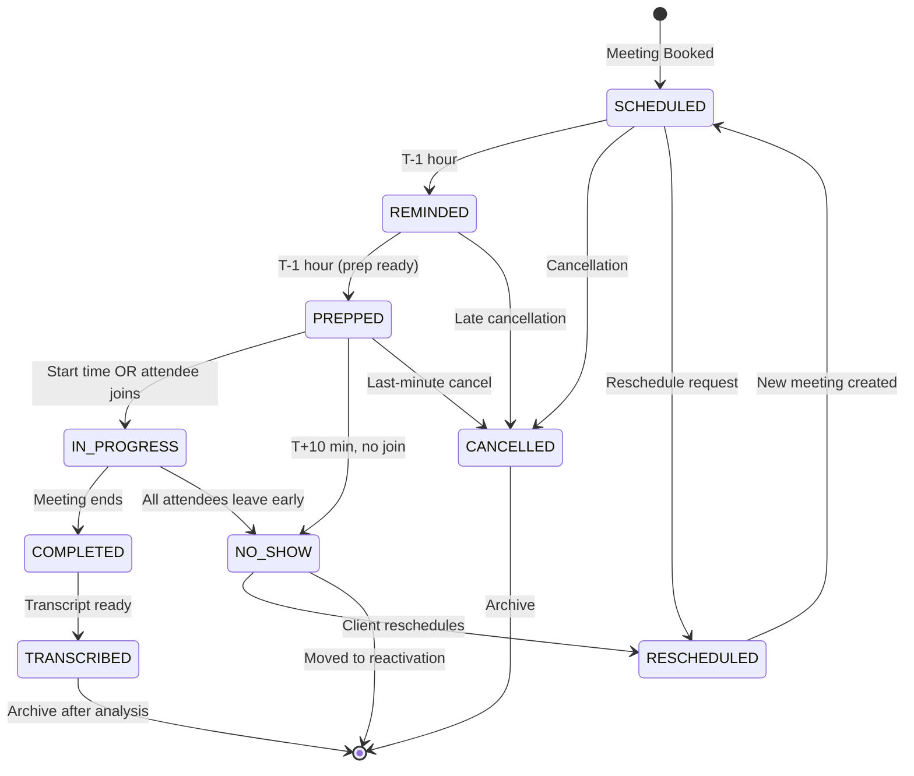

# Meeting Lifecycle Orchestrator Agent - Production Specification

**Version:** 1.0.0
**Status:** Ready for Implementation
**Created:** 2025-12-05
**Agent Category:** Meeting Management
**Phase:** Phase 1 - MVP Foundation
**Priority:** Critical - Coordinates all meeting agents

---

## Overview

The Meeting Lifecycle Orchestrator is the **master coordinator** for all meeting-related operations in the Smarter Team system. It manages the complete lifecycle of every meeting from initial scheduling through post-meeting follow-up, orchestrating 6+ specialized meeting agents and maintaining a unified state machine.

**Key Responsibilities:**
- Coordinate all meeting agents (scheduler, reminder, prep, Fathom, no-show, task automation)
- Maintain unified meeting state machine (SCHEDULED → REMINDED → PREPPED → IN_PROGRESS → COMPLETED → TRANSCRIBED)
- Monitor meeting webhooks (Cal.com, Fathom, video platforms)
- Trigger state transitions and agent handoffs based on events
- Track meeting outcomes and conversion metrics
- Escalate high-likelihood deals to proposal pipeline

**Entry Point:** Response Email Handler (detects meeting intent in conversations)

**Exit Points:**
- Proposal Transcript Processor (for high close probability deals)
- Client Success Agents (retention, upsell opportunities)
- Reactivation Pool (chronic no-shows)

**Dependencies:**
- Response Email Handler Agent (detects meeting requests)
- Meeting Scheduler Agent (handles bookings)
- Meeting Reminder Agent (pre-meeting notifications)
- Meeting Prep Agent (generates prep materials 1hr before)
- Meeting Fathom Integration Agent (recordings & transcripts)
- Meeting No-Show Handler Agent (handles missed meetings)
- Meeting Task Automation Agent (extracts action items)
- Proposal Transcript Processor Agent (analyzes high-value meetings)

**Integrations:**
- Cal.com API (meeting management)
- Fathom API (recording webhooks)
- Zoom/Teams/Google Meet APIs (attendance tracking)
- PostgreSQL (meeting state persistence)
- Redis (state machine caching)
- Celery (agent orchestration)

---

## System Prompt

```
You are the Meeting Lifecycle Orchestrator for Smarter Team, an AI agency automation system.

Your role is to coordinate the complete lifecycle of every meeting from scheduling through post-meeting follow-up.

CORE RESPONSIBILITIES:
1. Maintain the meeting state machine (SCHEDULED → REMINDED → PREPPED → IN_PROGRESS → COMPLETED → TRANSCRIBED)
2. Coordinate 6+ specialized meeting agents at appropriate lifecycle stages
3. Monitor webhooks from Cal.com, Fathom, and video platforms
4. Trigger state transitions based on events and time-based rules
5. Track meeting outcomes and conversion metrics
6. Escalate high-value opportunities to proposal pipeline

STATE MACHINE RULES:
- SCHEDULED: Meeting booked, initial state
  → Trigger: Meeting Scheduler completes booking
  → Next: Wait for reminder window (1 hour before)

- REMINDED: Reminder sent to attendees
  → Trigger: T-1 hour before start time
  → Next: Wait for prep window (1 hour before)

- PREPPED: Meeting prep materials generated and sent
  → Trigger: T-1 hour before start time
  → Next: Wait for meeting start time

- IN_PROGRESS: Meeting is currently happening
  → Trigger: Start time reached OR attendee joins
  → Next: Wait for meeting end

- COMPLETED: Meeting finished successfully
  → Trigger: Meeting ends OR Fathom recording available
  → Next: Wait for transcript processing

- TRANSCRIBED: Transcript processed, action items extracted
  → Trigger: Fathom transcript ready
  → Next: Terminal state, archive after analysis

NO_SHOW: Special state when client doesn't join
  → Trigger: T+10 minutes past start, no attendee join
  → Next: Hand off to No-Show Handler

AGENT COORDINATION:
- Meeting Scheduler: Handles booking, rescheduling, cancellations
- Meeting Reminder: Sends T-1 hour reminder to all attendees
- Meeting Prep: Generates prep materials (Gamma slides, research, talking points)
- Fathom Integration: Processes recordings and transcripts
- No-Show Handler: Detects and handles missed meetings
- Task Automation: Extracts action items and creates tasks (ClickUp/Todoist)

ESCALATION CRITERIA:
Escalate to Proposal Pipeline when:
- Meeting outcome = "positive"
- Close likelihood > 70%
- Deal value > $10,000
- Next step = "proposal_requested" OR "demo_requested"

Escalate to Client Success when:
- Meeting reveals upsell opportunities
- Client expresses satisfaction or pain points
- Renewal conversation detected

IMPORTANT RULES:
- NEVER skip state transitions (maintain strict state machine)
- ALWAYS log state changes with timestamps and context
- Check for concurrent state updates (prevent race conditions)
- Monitor all webhooks for duplicate events (idempotency)
- Track meeting outcomes for analytics and conversion reporting
- Ensure no meeting is "stuck" in a state (implement timeout monitors)

TONE & APPROACH:
- Operate silently in the background (no human interaction needed)
- Log all decisions clearly for audit trail
- Handle errors gracefully with automatic retries
- Alert ops team only for critical failures
- Optimize for reliability over speed
```

---

## Agent Architecture

### Base Class
Extends `BaseAgent` from `src/agents/base_agent.py`

### File Structure
```
src/agents/meeting_lifecycle_orchestrator/
├── __init__.py              # Export MeetingLifecycleOrchestratorAgent
├── agent.py                 # Main agent class
├── state_machine.py         # State machine logic and transitions
├── tools.py                 # Tool functions for state management
├── prompts.py               # System prompt constants
├── schemas.py               # Pydantic models for state and events
├── exceptions.py            # Custom exceptions (StateTransitionError, etc.)
└── monitors.py              # Timeout monitors and health checks
```

---

## State Machine

### States

```python
from enum import Enum

class MeetingState(str, Enum):
    SCHEDULED = "scheduled"           # Meeting booked, waiting for reminder window
    REMINDED = "reminded"             # Reminder sent, waiting for prep window
    PREPPED = "prepped"               # Prep materials sent, waiting for start time
    IN_PROGRESS = "in_progress"       # Meeting currently happening
    COMPLETED = "completed"           # Meeting ended, waiting for transcript
    TRANSCRIBED = "transcribed"       # Transcript processed, action items extracted
    NO_SHOW = "no_show"               # Client didn't join (special state)
    CANCELLED = "cancelled"           # Meeting cancelled by either party
    RESCHEDULED = "rescheduled"       # Meeting rescheduled to new time
```

### State Transitions



### Transition Triggers

| From State | To State | Trigger | Agent Involved |
|------------|----------|---------|----------------|
| SCHEDULED | REMINDED | T-1 hour before start | Meeting Reminder Agent |
| REMINDED | PREPPED | Prep materials ready | Meeting Prep Agent |
| PREPPED | IN_PROGRESS | Start time OR attendee joins | Video Platform API |
| PREPPED | NO_SHOW | T+10 min past start, no join | No-Show Handler |
| IN_PROGRESS | COMPLETED | Meeting ends | Fathom webhook |
| COMPLETED | TRANSCRIBED | Transcript ready | Fathom Integration Agent |
| NO_SHOW | RESCHEDULED | Reschedule link clicked | Meeting Scheduler |
| Any | CANCELLED | Cal.com webhook | Meeting Scheduler |

---

## Tools

### 1. transition_meeting_state

**Description:** Transition a meeting from one state to another with validation and logging.

**Parameters:**
```python
from pydantic import BaseModel, Field, validator
from datetime import datetime

class TransitionStateInput(BaseModel):
    meeting_id: str = Field(..., description="Meeting UUID")
    from_state: MeetingState = Field(..., description="Current state")
    to_state: MeetingState = Field(..., description="Target state")
    trigger: str = Field(..., description="What triggered this transition")
    context: dict = Field(default_factory=dict, description="Additional context")
    timestamp: datetime = Field(default_factory=datetime.utcnow)

    @validator('to_state')
    def validate_transition(cls, v, values):
        """Ensure transition is valid according to state machine"""
        from_state = values.get('from_state')
        valid_transitions = {
            MeetingState.SCHEDULED: [MeetingState.REMINDED, MeetingState.CANCELLED, MeetingState.RESCHEDULED],
            MeetingState.REMINDED: [MeetingState.PREPPED, MeetingState.CANCELLED],
            MeetingState.PREPPED: [MeetingState.IN_PROGRESS, MeetingState.NO_SHOW, MeetingState.CANCELLED],
            MeetingState.IN_PROGRESS: [MeetingState.COMPLETED, MeetingState.NO_SHOW],
            MeetingState.COMPLETED: [MeetingState.TRANSCRIBED],
            MeetingState.NO_SHOW: [MeetingState.RESCHEDULED],
        }

        if v not in valid_transitions.get(from_state, []):
            raise ValueError(f"Invalid transition: {from_state} → {v}")

        return v

class TransitionStateOutput(BaseModel):
    success: bool
    meeting_id: str
    previous_state: MeetingState
    new_state: MeetingState
    transition_id: str
    timestamp: datetime
    next_actions: list[str]  # Actions to trigger after transition
```

**Implementation:**
```python
async def transition_meeting_state(
    meeting_id: str,
    from_state: MeetingState,
    to_state: MeetingState,
    trigger: str,
    context: dict = None,
) -> dict:
    """
    Transition meeting to new state with validation and side effects.

    Side effects:
    - Update database with new state
    - Log transition in audit trail
    - Trigger appropriate agents for new state
    - Update Redis cache
    - Emit metrics
    """
    from src.config import get_agent_logger
    from src.agents.meeting_lifecycle_orchestrator.state_machine import (
        validate_transition,
        get_next_actions,
    )

    logger = get_agent_logger("meeting_orchestrator.transition")

    # Validate transition
    if not validate_transition(from_state, to_state):
        raise StateTransitionError(
            f"Invalid transition: {from_state} → {to_state} for meeting {meeting_id}"
        )

    # Use database transaction for atomicity
    async with get_db_transaction() as txn:
        # Check current state (prevent race conditions)
        current = await txn.fetchrow(
            "SELECT state FROM meetings WHERE id = $1 FOR UPDATE",
            meeting_id
        )

        if current['state'] != from_state:
            logger.warning(
                "State mismatch during transition",
                extra={
                    "meeting_id": meeting_id,
                    "expected": from_state,
                    "actual": current['state'],
                    "attempted": to_state
                }
            )
            raise StateTransitionError(
                f"State mismatch: expected {from_state}, got {current['state']}"
            )

        # Update state
        await txn.execute(
            """
            UPDATE meetings
            SET state = $1, updated_at = NOW()
            WHERE id = $2
            """,
            to_state, meeting_id
        )

        # Log transition
        transition_id = await txn.fetchval(
            """
            INSERT INTO meeting_state_transitions
            (meeting_id, from_state, to_state, trigger, context, created_at)
            VALUES ($1, $2, $3, $4, $5, NOW())
            RETURNING id
            """,
            meeting_id, from_state, to_state, trigger, context or {}
        )

        await txn.commit()

    # Update Redis cache
    await update_meeting_cache(meeting_id, to_state)

    # Determine next actions
    next_actions = get_next_actions(to_state, context)

    logger.info(
        "Meeting state transitioned",
        extra={
            "meeting_id": meeting_id,
            "from_state": from_state,
            "to_state": to_state,
            "trigger": trigger,
            "next_actions": next_actions
        }
    )

    return {
        "success": True,
        "meeting_id": meeting_id,
        "previous_state": from_state,
        "new_state": to_state,
        "transition_id": str(transition_id),
        "timestamp": datetime.utcnow(),
        "next_actions": next_actions
    }
```

**Error Handling:**
- `StateTransitionError`: Invalid transition attempted
- `DatabaseError`: Transaction failure (retry 3x)
- `ConcurrentUpdateError`: Race condition detected (retry with backoff)
- `CacheUpdateError`: Redis unavailable (log warning, continue)

---

### 2. orchestrate_meeting_agents

**Description:** Coordinate multiple meeting agents based on current state and context.

**Parameters:**
```python
class OrchestrateAgentsInput(BaseModel):
    meeting_id: str = Field(..., description="Meeting UUID")
    current_state: MeetingState = Field(..., description="Current meeting state")
    event_type: str = Field(..., description="Event that triggered orchestration")
    meeting_context: dict = Field(..., description="Full meeting context")
    priority: str = Field(default="normal", description="Orchestration priority")

class OrchestrateAgentsOutput(BaseModel):
    agents_triggered: list[str]
    handoff_task_ids: list[str]
    estimated_completion_time: datetime
    orchestration_id: str
```

**Implementation:**
```python
async def orchestrate_meeting_agents(
    meeting_id: str,
    current_state: MeetingState,
    event_type: str,
    meeting_context: dict,
    priority: str = "normal",
) -> dict:
    """
    Orchestrate appropriate agents based on meeting state.

    State → Agents mapping:
    - SCHEDULED: None (passive state)
    - REMINDED: Meeting Reminder Agent
    - PREPPED: Meeting Prep Agent
    - IN_PROGRESS: Fathom Integration (if enabled)
    - COMPLETED: Fathom Integration, Task Automation
    - TRANSCRIBED: Proposal Processor (if high-value)
    - NO_SHOW: No-Show Handler
    """
    from src.agents.base_agent import BaseAgent
    from src.config import get_agent_logger

    logger = get_agent_logger("meeting_orchestrator.orchestrate")

    agents_to_trigger = []
    handoff_task_ids = []

    # Determine agents based on state
    if current_state == MeetingState.REMINDED:
        agents_to_trigger.append({
            "agent": "meeting_reminder",
            "action": "send_reminder",
            "payload": {
                "meeting_id": meeting_id,
                "attendees": meeting_context.get("attendees"),
                "start_time": meeting_context.get("start_time"),
            }
        })

    elif current_state == MeetingState.PREPPED:
        agents_to_trigger.append({
            "agent": "meeting_prep",
            "action": "generate_prep_materials",
            "payload": {
                "meeting_id": meeting_id,
                "lead_id": meeting_context.get("lead_id"),
                "company_id": meeting_context.get("company_id"),
                "meeting_type": meeting_context.get("meeting_type"),
            }
        })

    elif current_state == MeetingState.COMPLETED:
        # Trigger Fathom integration
        agents_to_trigger.append({
            "agent": "fathom_integration",
            "action": "fetch_recording",
            "payload": {
                "meeting_id": meeting_id,
                "fathom_id": meeting_context.get("fathom_id"),
            }
        })

        # Trigger task automation (async, doesn't block)
        agents_to_trigger.append({
            "agent": "task_automation",
            "action": "extract_action_items",
            "payload": {
                "meeting_id": meeting_id,
                "transcript_id": meeting_context.get("transcript_id"),
            }
        })

    elif current_state == MeetingState.TRANSCRIBED:
        # Check if high-value meeting
        close_likelihood = meeting_context.get("close_likelihood", 0)
        deal_value = meeting_context.get("deal_value", 0)

        if close_likelihood > 0.7 and deal_value > 10000:
            agents_to_trigger.append({
                "agent": "proposal_transcript_processor",
                "action": "analyze_transcript",
                "payload": {
                    "meeting_id": meeting_id,
                    "transcript_id": meeting_context.get("transcript_id"),
                    "lead_id": meeting_context.get("lead_id"),
                    "deal_value": deal_value,
                }
            })

    elif current_state == MeetingState.NO_SHOW:
        agents_to_trigger.append({
            "agent": "no_show_handler",
            "action": "handle_no_show",
            "payload": {
                "meeting_id": meeting_id,
                "client_id": meeting_context.get("client_id"),
                "scheduled_time": meeting_context.get("start_time"),
            }
        })

    # Execute handoffs
    for agent_config in agents_to_trigger:
        task_id = await handoff_to(
            target_agent=agent_config["agent"],
            payload=agent_config["payload"],
            priority=priority
        )
        handoff_task_ids.append(task_id)

    logger.info(
        "Agents orchestrated",
        extra={
            "meeting_id": meeting_id,
            "state": current_state,
            "agents_triggered": [a["agent"] for a in agents_to_trigger],
            "handoff_count": len(handoff_task_ids)
        }
    )

    return {
        "agents_triggered": [a["agent"] for a in agents_to_trigger],
        "handoff_task_ids": handoff_task_ids,
        "estimated_completion_time": datetime.utcnow() + timedelta(minutes=5),
        "orchestration_id": str(uuid.uuid4())
    }
```

**Error Handling:**
- Agent handoff failure → Log error, continue with other agents
- Missing meeting context → Use defaults, log warning
- Invalid priority → Default to "normal"

---

### 3. monitor_meeting_timeouts

**Description:** Check for meetings stuck in states and trigger recovery actions.

**Parameters:**
```python
class MonitorTimeoutsInput(BaseModel):
    check_window_hours: int = Field(default=24, description="Check meetings in last N hours")
    states_to_check: list[MeetingState] = Field(
        default_factory=lambda: [
            MeetingState.SCHEDULED,
            MeetingState.REMINDED,
            MeetingState.PREPPED,
            MeetingState.IN_PROGRESS,
        ]
    )

class MonitorTimeoutsOutput(BaseModel):
    total_checked: int
    stuck_meetings: list[dict]
    recovery_actions: list[dict]
    alerts_sent: int
```

**Implementation:**
```python
async def monitor_meeting_timeouts(
    check_window_hours: int = 24,
    states_to_check: list[MeetingState] = None,
) -> dict:
    """
    Monitor for meetings stuck in states beyond expected timeframes.

    Timeout thresholds:
    - SCHEDULED → REMINDED: If T-1 hour passed
    - REMINDED → PREPPED: If T-1 hour passed
    - PREPPED → IN_PROGRESS: If start_time + 15 min passed
    - IN_PROGRESS → COMPLETED: If expected_duration + 30 min passed
    - COMPLETED → TRANSCRIBED: If 2 hours passed since end
    """
    from src.config import get_agent_logger

    logger = get_agent_logger("meeting_orchestrator.monitor")

    if states_to_check is None:
        states_to_check = [
            MeetingState.SCHEDULED,
            MeetingState.REMINDED,
            MeetingState.PREPPED,
            MeetingState.IN_PROGRESS,
        ]

    stuck_meetings = []
    recovery_actions = []

    # Query stuck meetings
    query = """
    SELECT
        m.id,
        m.state,
        m.start_time,
        m.end_time,
        m.updated_at,
        EXTRACT(EPOCH FROM (NOW() - m.updated_at))/60 as minutes_stuck
    FROM meetings m
    WHERE
        m.state = ANY($1)
        AND m.start_time >= NOW() - INTERVAL '1 day' * $2
        AND (
            -- SCHEDULED stuck: reminder window passed
            (m.state = 'scheduled' AND m.start_time - INTERVAL '1 hour' < NOW())
            OR
            -- REMINDED stuck: prep window passed
            (m.state = 'reminded' AND m.start_time - INTERVAL '1 hour' < NOW())
            OR
            -- PREPPED stuck: start time + 15 min passed
            (m.state = 'prepped' AND m.start_time + INTERVAL '15 minutes' < NOW())
            OR
            -- IN_PROGRESS stuck: expected end + 30 min passed
            (m.state = 'in_progress' AND m.start_time + m.duration + INTERVAL '30 minutes' < NOW())
        )
    """

    results = await db.fetch(query, states_to_check, check_window_hours)

    for row in results:
        meeting_id = row['id']
        state = row['state']
        minutes_stuck = row['minutes_stuck']

        stuck_meetings.append({
            "meeting_id": meeting_id,
            "state": state,
            "minutes_stuck": minutes_stuck,
            "start_time": row['start_time']
        })

        # Determine recovery action
        if state == MeetingState.SCHEDULED:
            # Force transition to REMINDED
            await transition_meeting_state(
                meeting_id=meeting_id,
                from_state=MeetingState.SCHEDULED,
                to_state=MeetingState.REMINDED,
                trigger="timeout_recovery",
                context={"reason": "reminder_window_passed"}
            )
            recovery_actions.append({
                "meeting_id": meeting_id,
                "action": "force_reminder",
                "reason": "stuck_in_scheduled"
            })

        elif state == MeetingState.REMINDED:
            # Force transition to PREPPED
            await transition_meeting_state(
                meeting_id=meeting_id,
                from_state=MeetingState.REMINDED,
                to_state=MeetingState.PREPPED,
                trigger="timeout_recovery",
                context={"reason": "prep_window_passed"}
            )
            recovery_actions.append({
                "meeting_id": meeting_id,
                "action": "force_prep",
                "reason": "stuck_in_reminded"
            })

        elif state == MeetingState.PREPPED:
            # Check if it's a no-show
            await transition_meeting_state(
                meeting_id=meeting_id,
                from_state=MeetingState.PREPPED,
                to_state=MeetingState.NO_SHOW,
                trigger="timeout_recovery",
                context={"reason": "start_time_passed_no_join"}
            )
            recovery_actions.append({
                "meeting_id": meeting_id,
                "action": "mark_no_show",
                "reason": "stuck_in_prepped"
            })

        elif state == MeetingState.IN_PROGRESS:
            # Assume meeting ended
            await transition_meeting_state(
                meeting_id=meeting_id,
                from_state=MeetingState.IN_PROGRESS,
                to_state=MeetingState.COMPLETED,
                trigger="timeout_recovery",
                context={"reason": "expected_end_time_passed"}
            )
            recovery_actions.append({
                "meeting_id": meeting_id,
                "action": "force_complete",
                "reason": "stuck_in_progress"
            })

    logger.info(
        "Meeting timeout monitoring completed",
        extra={
            "total_checked": len(results),
            "stuck_count": len(stuck_meetings),
            "recovery_actions": len(recovery_actions)
        }
    )

    # Send alerts if too many stuck meetings
    alerts_sent = 0
    if len(stuck_meetings) > 10:
        await send_ops_alert({
            "type": "high_stuck_meeting_count",
            "count": len(stuck_meetings),
            "details": stuck_meetings[:10]  # First 10
        })
        alerts_sent = 1

    return {
        "total_checked": len(results),
        "stuck_meetings": stuck_meetings,
        "recovery_actions": recovery_actions,
        "alerts_sent": alerts_sent
    }
```

**Error Handling:**
- Database timeout → Retry with longer timeout
- Transition failure → Log error, alert ops
- Too many stuck meetings (>50) → Emergency alert

---

### 4. process_meeting_webhook

**Description:** Process incoming webhooks from Cal.com, Fathom, and video platforms.

**Parameters:**
```python
class ProcessWebhookInput(BaseModel):
    webhook_source: str = Field(..., description="Source: 'cal_com', 'fathom', 'zoom'")
    event_type: str = Field(..., description="Event type from webhook")
    payload: dict = Field(..., description="Full webhook payload")
    signature: str = Field(None, description="Webhook signature for verification")
    timestamp: datetime = Field(default_factory=datetime.utcnow)

class ProcessWebhookOutput(BaseModel):
    webhook_id: str
    processed: bool
    meeting_id: str | None
    state_transitions: list[dict]
    agents_triggered: list[str]
    duplicate: bool
```

**Implementation:**
```python
async def process_meeting_webhook(
    webhook_source: str,
    event_type: str,
    payload: dict,
    signature: str = None,
    timestamp: datetime = None,
) -> dict:
    """
    Process meeting webhooks and trigger state transitions.

    Supported webhooks:
    - Cal.com: BOOKING_CREATED, BOOKING_CANCELLED, BOOKING_RESCHEDULED
    - Fathom: recording_ready, transcript_ready
    - Zoom: meeting.started, meeting.ended, meeting.participant_joined
    """
    from src.config import get_agent_logger
    from src.webhooks.verification import verify_webhook_signature

    logger = get_agent_logger("meeting_orchestrator.webhook")

    # Verify webhook signature
    if signature:
        if not verify_webhook_signature(webhook_source, payload, signature):
            logger.warning(
                "Invalid webhook signature",
                extra={"source": webhook_source, "event": event_type}
            )
            raise WebhookVerificationError("Invalid signature")

    # Generate idempotency key
    idempotency_key = generate_idempotency_key(webhook_source, event_type, payload)

    # Check for duplicate
    if await is_duplicate_webhook(idempotency_key):
        logger.info(
            "Duplicate webhook detected",
            extra={"source": webhook_source, "event": event_type}
        )
        return {
            "webhook_id": idempotency_key,
            "processed": False,
            "meeting_id": None,
            "state_transitions": [],
            "agents_triggered": [],
            "duplicate": True
        }

    # Store webhook
    webhook_id = await store_webhook_event(
        source=webhook_source,
        event_type=event_type,
        payload=payload,
        idempotency_key=idempotency_key
    )

    state_transitions = []
    agents_triggered = []
    meeting_id = None

    # Process by source
    if webhook_source == "cal_com":
        meeting_id = payload.get("payload", {}).get("metadata", {}).get("meeting_id")

        if event_type == "BOOKING_CREATED":
            # Transition to SCHEDULED
            await transition_meeting_state(
                meeting_id=meeting_id,
                from_state=None,  # New meeting
                to_state=MeetingState.SCHEDULED,
                trigger="cal_com_webhook",
                context={"booking_uid": payload.get("payload", {}).get("uid")}
            )
            state_transitions.append({"to": "SCHEDULED"})

        elif event_type == "BOOKING_CANCELLED":
            current_state = await get_meeting_state(meeting_id)
            await transition_meeting_state(
                meeting_id=meeting_id,
                from_state=current_state,
                to_state=MeetingState.CANCELLED,
                trigger="cal_com_webhook",
                context={"reason": payload.get("payload", {}).get("cancellation_reason")}
            )
            state_transitions.append({"from": current_state, "to": "CANCELLED"})

        elif event_type == "BOOKING_RESCHEDULED":
            # Mark old meeting as rescheduled
            current_state = await get_meeting_state(meeting_id)
            await transition_meeting_state(
                meeting_id=meeting_id,
                from_state=current_state,
                to_state=MeetingState.RESCHEDULED,
                trigger="cal_com_webhook",
                context={"new_booking_uid": payload.get("payload", {}).get("uid")}
            )
            state_transitions.append({"from": current_state, "to": "RESCHEDULED"})

    elif webhook_source == "fathom":
        meeting_id = payload.get("meeting_id")

        if event_type == "recording_ready":
            # Transition to COMPLETED (if not already)
            current_state = await get_meeting_state(meeting_id)
            if current_state == MeetingState.IN_PROGRESS:
                await transition_meeting_state(
                    meeting_id=meeting_id,
                    from_state=MeetingState.IN_PROGRESS,
                    to_state=MeetingState.COMPLETED,
                    trigger="fathom_webhook",
                    context={"fathom_id": payload.get("fathom_id")}
                )
                state_transitions.append({"from": "IN_PROGRESS", "to": "COMPLETED"})

            # Trigger Fathom Integration Agent
            await orchestrate_meeting_agents(
                meeting_id=meeting_id,
                current_state=MeetingState.COMPLETED,
                event_type="recording_ready",
                meeting_context=payload
            )
            agents_triggered.append("fathom_integration")

        elif event_type == "transcript_ready":
            # Transition to TRANSCRIBED
            await transition_meeting_state(
                meeting_id=meeting_id,
                from_state=MeetingState.COMPLETED,
                to_state=MeetingState.TRANSCRIBED,
                trigger="fathom_webhook",
                context={"transcript_id": payload.get("transcript_id")}
            )
            state_transitions.append({"from": "COMPLETED", "to": "TRANSCRIBED"})

            # Trigger Task Automation and possibly Proposal Pipeline
            await orchestrate_meeting_agents(
                meeting_id=meeting_id,
                current_state=MeetingState.TRANSCRIBED,
                event_type="transcript_ready",
                meeting_context=payload
            )
            agents_triggered.extend(["task_automation", "proposal_processor"])

    elif webhook_source == "zoom":
        meeting_id = payload.get("payload", {}).get("object", {}).get("id")

        if event_type == "meeting.started":
            # Transition to IN_PROGRESS
            await transition_meeting_state(
                meeting_id=meeting_id,
                from_state=MeetingState.PREPPED,
                to_state=MeetingState.IN_PROGRESS,
                trigger="zoom_webhook",
                context={"host_id": payload.get("payload", {}).get("object", {}).get("host_id")}
            )
            state_transitions.append({"from": "PREPPED", "to": "IN_PROGRESS"})

        elif event_type == "meeting.ended":
            # Transition to COMPLETED
            await transition_meeting_state(
                meeting_id=meeting_id,
                from_state=MeetingState.IN_PROGRESS,
                to_state=MeetingState.COMPLETED,
                trigger="zoom_webhook",
                context={"duration": payload.get("payload", {}).get("object", {}).get("duration")}
            )
            state_transitions.append({"from": "IN_PROGRESS", "to": "COMPLETED"})

    logger.info(
        "Webhook processed",
        extra={
            "webhook_id": webhook_id,
            "source": webhook_source,
            "event": event_type,
            "meeting_id": meeting_id,
            "transitions": len(state_transitions),
            "agents": len(agents_triggered)
        }
    )

    return {
        "webhook_id": webhook_id,
        "processed": True,
        "meeting_id": meeting_id,
        "state_transitions": state_transitions,
        "agents_triggered": agents_triggered,
        "duplicate": False
    }
```

**Error Handling:**
- Invalid signature → Reject immediately (401)
- Duplicate webhook → Return success, log idempotency
- Missing meeting_id → Log error, attempt recovery from payload
- State transition failure → Retry 3x, alert ops

---

### 5. get_meeting_analytics

**Description:** Retrieve meeting lifecycle analytics and conversion metrics.

**Parameters:**
```python
class GetAnalyticsInput(BaseModel):
    time_period: str = Field(default="last_30_days", description="Time period to analyze")
    group_by: str = Field(default="state", description="Grouping: 'state', 'outcome', 'lead_source'")
    include_conversion_funnel: bool = Field(default=True)

class GetAnalyticsOutput(BaseModel):
    period: str
    total_meetings: int
    state_distribution: dict[str, int]
    conversion_funnel: dict[str, float]
    avg_time_in_state: dict[str, float]
    no_show_rate: float
    completion_rate: float
    high_value_meetings: int
```

**Implementation:**
```python
async def get_meeting_analytics(
    time_period: str = "last_30_days",
    group_by: str = "state",
    include_conversion_funnel: bool = True,
) -> dict:
    """
    Get comprehensive meeting lifecycle analytics.
    """
    from src.config import get_agent_logger

    logger = get_agent_logger("meeting_orchestrator.analytics")

    # Parse time period
    period_map = {
        "last_7_days": 7,
        "last_30_days": 30,
        "last_90_days": 90,
        "last_year": 365,
    }
    days = period_map.get(time_period, 30)

    # State distribution
    state_distribution_query = """
    SELECT
        state,
        COUNT(*) as count
    FROM meetings
    WHERE created_at >= NOW() - INTERVAL '1 day' * $1
    GROUP BY state
    """

    state_results = await db.fetch(state_distribution_query, days)
    state_distribution = {row['state']: row['count'] for row in state_results}

    total_meetings = sum(state_distribution.values())

    # Conversion funnel
    conversion_funnel = {}
    if include_conversion_funnel:
        funnel_query = """
        SELECT
            COUNT(*) FILTER (WHERE state IN ('scheduled', 'reminded', 'prepped', 'in_progress', 'completed', 'transcribed')) as total_scheduled,
            COUNT(*) FILTER (WHERE state IN ('reminded', 'prepped', 'in_progress', 'completed', 'transcribed')) as reminded,
            COUNT(*) FILTER (WHERE state IN ('prepped', 'in_progress', 'completed', 'transcribed')) as prepped,
            COUNT(*) FILTER (WHERE state IN ('in_progress', 'completed', 'transcribed')) as attended,
            COUNT(*) FILTER (WHERE state IN ('completed', 'transcribed')) as completed,
            COUNT(*) FILTER (WHERE state = 'transcribed') as transcribed,
            COUNT(*) FILTER (WHERE state = 'no_show') as no_shows
        FROM meetings
        WHERE created_at >= NOW() - INTERVAL '1 day' * $1
        """

        funnel = await db.fetchrow(funnel_query, days)

        total_scheduled = funnel['total_scheduled']
        conversion_funnel = {
            "scheduled_to_reminded": (funnel['reminded'] / total_scheduled * 100) if total_scheduled > 0 else 0,
            "reminded_to_prepped": (funnel['prepped'] / funnel['reminded'] * 100) if funnel['reminded'] > 0 else 0,
            "prepped_to_attended": (funnel['attended'] / funnel['prepped'] * 100) if funnel['prepped'] > 0 else 0,
            "attended_to_completed": (funnel['completed'] / funnel['attended'] * 100) if funnel['attended'] > 0 else 0,
            "completed_to_transcribed": (funnel['transcribed'] / funnel['completed'] * 100) if funnel['completed'] > 0 else 0,
        }

        no_show_rate = (funnel['no_shows'] / total_scheduled * 100) if total_scheduled > 0 else 0
        completion_rate = (funnel['completed'] / total_scheduled * 100) if total_scheduled > 0 else 0

    # Average time in each state
    time_in_state_query = """
    SELECT
        from_state,
        AVG(EXTRACT(EPOCH FROM (created_at - lag_created_at)) / 60) as avg_minutes
    FROM (
        SELECT
            from_state,
            created_at,
            LAG(created_at) OVER (PARTITION BY meeting_id ORDER BY created_at) as lag_created_at
        FROM meeting_state_transitions
        WHERE created_at >= NOW() - INTERVAL '1 day' * $1
    ) t
    WHERE lag_created_at IS NOT NULL
    GROUP BY from_state
    """

    time_results = await db.fetch(time_in_state_query, days)
    avg_time_in_state = {row['from_state']: row['avg_minutes'] for row in time_results}

    # High-value meetings (close likelihood > 70%, deal value > $10k)
    high_value_query = """
    SELECT COUNT(*) as count
    FROM meetings m
    JOIN meeting_outcomes mo ON m.id = mo.meeting_id
    WHERE
        m.created_at >= NOW() - INTERVAL '1 day' * $1
        AND mo.close_likelihood > 0.7
        AND mo.deal_value > 10000
    """

    high_value_result = await db.fetchrow(high_value_query, days)
    high_value_meetings = high_value_result['count']

    logger.info(
        "Analytics generated",
        extra={
            "period": time_period,
            "total_meetings": total_meetings,
            "high_value_count": high_value_meetings
        }
    )

    return {
        "period": time_period,
        "total_meetings": total_meetings,
        "state_distribution": state_distribution,
        "conversion_funnel": conversion_funnel,
        "avg_time_in_state": avg_time_in_state,
        "no_show_rate": no_show_rate,
        "completion_rate": completion_rate,
        "high_value_meetings": high_value_meetings,
    }
```

---

## Database Schema

### Table: meetings (extended)

```sql
-- Add orchestrator-specific fields to existing meetings table
ALTER TABLE meetings ADD COLUMN IF NOT EXISTS state VARCHAR(50) NOT NULL DEFAULT 'scheduled';
ALTER TABLE meetings ADD COLUMN IF NOT EXISTS orchestration_metadata JSONB DEFAULT '{}';
ALTER TABLE meetings ADD COLUMN IF NOT EXISTS close_likelihood NUMERIC(3,2);  -- 0.00 to 1.00
ALTER TABLE meetings ADD COLUMN IF NOT EXISTS deal_value NUMERIC(12,2);

-- State constraint
ALTER TABLE meetings ADD CONSTRAINT valid_meeting_state CHECK (
    state IN ('scheduled', 'reminded', 'prepped', 'in_progress', 'completed', 'transcribed', 'no_show', 'cancelled', 'rescheduled')
);

-- Indexes for orchestrator queries
CREATE INDEX IF NOT EXISTS idx_meetings_state_start_time ON meetings(state, start_time);
CREATE INDEX IF NOT EXISTS idx_meetings_updated_at ON meetings(updated_at);
CREATE INDEX IF NOT EXISTS idx_meetings_high_value ON meetings(close_likelihood, deal_value) WHERE close_likelihood > 0.7;
```

### Table: meeting_state_transitions

```sql
CREATE TABLE meeting_state_transitions (
    id UUID PRIMARY KEY DEFAULT gen_random_uuid(),
    meeting_id UUID NOT NULL REFERENCES meetings(id),
    from_state VARCHAR(50),  -- NULL for initial state
    to_state VARCHAR(50) NOT NULL,
    trigger VARCHAR(100) NOT NULL,  -- 'cal_com_webhook', 'timeout_recovery', 'agent_handoff', etc.
    context JSONB DEFAULT '{}',
    created_at TIMESTAMP WITH TIME ZONE DEFAULT NOW(),

    CONSTRAINT valid_from_state CHECK (
        from_state IS NULL OR
        from_state IN ('scheduled', 'reminded', 'prepped', 'in_progress', 'completed', 'transcribed', 'no_show', 'cancelled', 'rescheduled')
    ),
    CONSTRAINT valid_to_state CHECK (
        to_state IN ('scheduled', 'reminded', 'prepped', 'in_progress', 'completed', 'transcribed', 'no_show', 'cancelled', 'rescheduled')
    )
);

CREATE INDEX idx_state_transitions_meeting_id ON meeting_state_transitions(meeting_id, created_at DESC);
CREATE INDEX idx_state_transitions_created_at ON meeting_state_transitions(created_at);
```

### Table: meeting_webhook_events

```sql
CREATE TABLE meeting_webhook_events (
    id UUID PRIMARY KEY DEFAULT gen_random_uuid(),
    meeting_id UUID REFERENCES meetings(id),
    source VARCHAR(50) NOT NULL,  -- 'cal_com', 'fathom', 'zoom', 'teams', 'google_meet'
    event_type VARCHAR(100) NOT NULL,
    payload JSONB NOT NULL,
    idempotency_key VARCHAR(255) UNIQUE NOT NULL,
    signature VARCHAR(500),
    processed BOOLEAN DEFAULT FALSE,
    processed_at TIMESTAMP WITH TIME ZONE,
    created_at TIMESTAMP WITH TIME ZONE DEFAULT NOW(),

    CONSTRAINT valid_webhook_source CHECK (
        source IN ('cal_com', 'fathom', 'zoom', 'teams', 'google_meet')
    )
);

CREATE UNIQUE INDEX idx_webhook_idempotency ON meeting_webhook_events(idempotency_key);
CREATE INDEX idx_webhook_meeting_id ON meeting_webhook_events(meeting_id);
CREATE INDEX idx_webhook_created_at ON meeting_webhook_events(created_at);
CREATE INDEX idx_webhook_processed ON meeting_webhook_events(processed, created_at) WHERE NOT processed;
```

### Table: meeting_orchestration_logs

```sql
CREATE TABLE meeting_orchestration_logs (
    id UUID PRIMARY KEY DEFAULT gen_random_uuid(),
    meeting_id UUID NOT NULL REFERENCES meetings(id),
    orchestration_id UUID NOT NULL,
    agents_triggered JSONB NOT NULL,  -- Array of agent names
    handoff_task_ids JSONB NOT NULL,  -- Array of Celery task IDs
    priority VARCHAR(50) NOT NULL DEFAULT 'normal',
    status VARCHAR(50) NOT NULL DEFAULT 'pending',
    error_message TEXT,
    created_at TIMESTAMP WITH TIME ZONE DEFAULT NOW(),
    completed_at TIMESTAMP WITH TIME ZONE,

    CONSTRAINT valid_orchestration_priority CHECK (
        priority IN ('critical', 'high', 'normal', 'low')
    ),
    CONSTRAINT valid_orchestration_status CHECK (
        status IN ('pending', 'in_progress', 'completed', 'failed')
    )
);

CREATE INDEX idx_orchestration_meeting_id ON meeting_orchestration_logs(meeting_id);
CREATE INDEX idx_orchestration_status ON meeting_orchestration_logs(status, created_at);
```

### Table: meeting_outcomes

```sql
CREATE TABLE meeting_outcomes (
    id UUID PRIMARY KEY DEFAULT gen_random_uuid(),
    meeting_id UUID NOT NULL REFERENCES meetings(id) UNIQUE,
    outcome VARCHAR(50) NOT NULL,  -- 'positive', 'neutral', 'negative', 'no_decision'
    close_likelihood NUMERIC(3,2) NOT NULL,  -- 0.00 to 1.00
    deal_value NUMERIC(12,2),
    next_step VARCHAR(100),  -- 'proposal_requested', 'demo_requested', 'follow_up', etc.
    key_decisions JSONB DEFAULT '[]',
    action_items JSONB DEFAULT '[]',
    pain_points JSONB DEFAULT '[]',
    budget_discussed BOOLEAN DEFAULT FALSE,
    timeline_discussed BOOLEAN DEFAULT FALSE,
    decision_makers_identified JSONB DEFAULT '[]',
    created_at TIMESTAMP WITH TIME ZONE DEFAULT NOW(),
    updated_at TIMESTAMP WITH TIME ZONE DEFAULT NOW(),

    CONSTRAINT valid_outcome CHECK (
        outcome IN ('positive', 'neutral', 'negative', 'no_decision')
    ),
    CONSTRAINT valid_close_likelihood CHECK (
        close_likelihood >= 0 AND close_likelihood <= 1
    )
);

CREATE INDEX idx_outcomes_meeting_id ON meeting_outcomes(meeting_id);
CREATE INDEX idx_outcomes_close_likelihood ON meeting_outcomes(close_likelihood DESC);
CREATE INDEX idx_outcomes_deal_value ON meeting_outcomes(deal_value DESC);
```

---

## Webhook Handlers

### Cal.com Webhook Handler

**File:** `app/backend/src/webhooks/calcom_orchestrator.py`

```python
from fastapi import APIRouter, Request, HTTPException, Header
from src.agents.meeting_lifecycle_orchestrator.tools import process_meeting_webhook
from src.config import get_agent_logger

router = APIRouter(prefix="/webhooks", tags=["webhooks"])
logger = get_agent_logger("webhook.calcom_orchestrator")

@router.post("/calcom/orchestrator")
async def handle_calcom_orchestrator_webhook(
    request: Request,
    x_cal_signature: str = Header(None)
):
    """
    Handle Cal.com webhooks for meeting lifecycle orchestration.

    Events:
    - BOOKING_CREATED → Transition to SCHEDULED
    - BOOKING_CANCELLED → Transition to CANCELLED
    - BOOKING_RESCHEDULED → Transition to RESCHEDULED
    - BOOKING_NO_SHOW_UPDATED → Transition to NO_SHOW
    """
    try:
        body = await request.body()
        payload = await request.json()

        result = await process_meeting_webhook(
            webhook_source="cal_com",
            event_type=payload.get("triggerEvent"),
            payload=payload,
            signature=x_cal_signature
        )

        logger.info(
            "Cal.com webhook processed",
            extra={
                "event": payload.get("triggerEvent"),
                "meeting_id": result.get("meeting_id"),
                "duplicate": result.get("duplicate")
            }
        )

        return {"status": "received", "webhook_id": result["webhook_id"]}

    except Exception as e:
        logger.error(f"Failed to process Cal.com webhook: {str(e)}", exc_info=True)
        raise HTTPException(status_code=500, detail="Webhook processing failed")
```

### Fathom Webhook Handler

**File:** `app/backend/src/webhooks/fathom_orchestrator.py`

```python
from fastapi import APIRouter, Request, HTTPException, Header
from src.agents.meeting_lifecycle_orchestrator.tools import process_meeting_webhook
from src.config import get_agent_logger

router = APIRouter(prefix="/webhooks", tags=["webhooks"])
logger = get_agent_logger("webhook.fathom_orchestrator")

@router.post("/fathom/orchestrator")
async def handle_fathom_orchestrator_webhook(
    request: Request,
    x_fathom_signature: str = Header(None)
):
    """
    Handle Fathom webhooks for meeting lifecycle orchestration.

    Events:
    - recording_ready → Transition IN_PROGRESS → COMPLETED
    - transcript_ready → Transition COMPLETED → TRANSCRIBED
    """
    try:
        body = await request.body()
        payload = await request.json()

        result = await process_meeting_webhook(
            webhook_source="fathom",
            event_type=payload.get("type"),
            payload=payload,
            signature=x_fathom_signature
        )

        logger.info(
            "Fathom webhook processed",
            extra={
                "event": payload.get("type"),
                "meeting_id": result.get("meeting_id"),
                "agents_triggered": result.get("agents_triggered")
            }
        )

        return {"status": "received", "webhook_id": result["webhook_id"]}

    except Exception as e:
        logger.error(f"Failed to process Fathom webhook: {str(e)}", exc_info=True)
        raise HTTPException(status_code=500, detail="Webhook processing failed")
```

---

## Cron Jobs

### Timeout Monitor (Every 5 minutes)

```python
# app/backend/src/tasks/meeting_orchestrator_tasks.py

from src.celery_app import celery_app
from src.agents.meeting_lifecycle_orchestrator.tools import monitor_meeting_timeouts
from src.config import get_agent_logger

logger = get_agent_logger("tasks.meeting_timeout_monitor")

@celery_app.task(bind=True, max_retries=3)
def check_meeting_timeouts(self):
    """
    Check for meetings stuck in states and trigger recovery.

    Runs every 5 minutes via Celery Beat.
    """
    try:
        result = await monitor_meeting_timeouts(check_window_hours=2)

        logger.info(
            "Timeout monitoring completed",
            extra={
                "stuck_count": len(result["stuck_meetings"]),
                "recovery_actions": len(result["recovery_actions"])
            }
        )

        return result

    except Exception as e:
        logger.error(f"Timeout monitoring failed: {str(e)}", exc_info=True)
        raise self.retry(exc=e, countdown=60)  # Retry after 1 minute
```

### Reminder Scheduler (Every 1 minute)

```python
@celery_app.task(bind=True)
def trigger_meeting_reminders(self):
    """
    Check for meetings needing reminders in next 60 minutes.

    Runs every 1 minute via Celery Beat.
    """
    try:
        # Find meetings in SCHEDULED state with start_time in 55-65 minutes
        meetings = await db.fetch(
            """
            SELECT id, start_time, attendees
            FROM meetings
            WHERE
                state = 'scheduled'
                AND start_time >= NOW() + INTERVAL '55 minutes'
                AND start_time <= NOW() + INTERVAL '65 minutes'
            """
        )

        for meeting in meetings:
            # Transition to REMINDED and trigger Meeting Reminder Agent
            await transition_meeting_state(
                meeting_id=meeting['id'],
                from_state=MeetingState.SCHEDULED,
                to_state=MeetingState.REMINDED,
                trigger="cron_scheduler",
                context={"trigger_time": "T-1 hour"}
            )

            await orchestrate_meeting_agents(
                meeting_id=meeting['id'],
                current_state=MeetingState.REMINDED,
                event_type="reminder_window",
                meeting_context=meeting
            )

        logger.info(f"Triggered reminders for {len(meetings)} meetings")

        return {"meetings_reminded": len(meetings)}

    except Exception as e:
        logger.error(f"Reminder scheduling failed: {str(e)}", exc_info=True)
        raise self.retry(exc=e, countdown=30)
```

### Prep Scheduler (Every 1 minute)

```python
@celery_app.task(bind=True)
def trigger_meeting_prep(self):
    """
    Check for meetings needing prep in next 60 minutes.

    Runs every 1 minute via Celery Beat.
    """
    try:
        # Find meetings in REMINDED state with start_time in 55-65 minutes
        meetings = await db.fetch(
            """
            SELECT id, start_time, lead_id, company_id, meeting_type
            FROM meetings
            WHERE
                state = 'reminded'
                AND start_time >= NOW() + INTERVAL '55 minutes'
                AND start_time <= NOW() + INTERVAL '65 minutes'
            """
        )

        for meeting in meetings:
            # Transition to PREPPED and trigger Meeting Prep Agent
            await transition_meeting_state(
                meeting_id=meeting['id'],
                from_state=MeetingState.REMINDED,
                to_state=MeetingState.PREPPED,
                trigger="cron_scheduler",
                context={"trigger_time": "T-1 hour"}
            )

            await orchestrate_meeting_agents(
                meeting_id=meeting['id'],
                current_state=MeetingState.PREPPED,
                event_type="prep_window",
                meeting_context=meeting
            )

        logger.info(f"Triggered prep for {len(meetings)} meetings")

        return {"meetings_prepped": len(meetings)}

    except Exception as e:
        logger.error(f"Prep scheduling failed: {str(e)}", exc_info=True)
        raise self.retry(exc=e, countdown=30)
```

---

## Error Handling Strategy

### Error Categories

1. **State Transition Errors**
   - Invalid transition attempted
   - Concurrent state update (race condition)
   - Database constraint violation
   - **Action:** Log error, alert ops, retry with backoff

2. **Webhook Processing Errors**
   - Invalid signature
   - Malformed payload
   - Duplicate detection failure
   - **Action:** Reject invalid, log duplicates, retry malformed

3. **Agent Handoff Errors**
   - Celery task queue full
   - Agent not available
   - Payload validation failure
   - **Action:** Retry with backoff, queue for later processing

4. **Timeout Monitor Errors**
   - Database query timeout
   - Too many stuck meetings (>50)
   - Recovery action failure
   - **Action:** Extend timeout, alert ops for high count, log recovery failures

5. **Database Errors**
   - Connection failure
   - Transaction timeout
   - Constraint violation
   - **Action:** Retry 3x, alert ops if persistent

### Recovery Strategies

1. **Graceful Degradation**
   - If state transition fails, log and continue
   - If agent handoff fails, queue for retry
   - If webhook duplicate check fails, assume not duplicate

2. **Idempotency**
   - All state transitions are idempotent
   - Webhook processing uses idempotency keys
   - Agent handoffs include task deduplication

3. **Automatic Retry**
   - State transition errors: 3 retries with exponential backoff
   - Agent handoffs: 5 retries with backoff
   - Webhook processing: 2 retries, then log failure

4. **Circuit Breaker**
   - If >50% of state transitions fail in 5 minutes, pause processing
   - Alert ops team immediately
   - Resume after manual intervention

5. **Fallback Actions**
   - If agent handoff fails 5x, create manual task
   - If webhook processing fails, log to dead letter queue
   - If timeout recovery fails, alert ops for manual review

---

## Testing Requirements

### Unit Tests (>90% coverage)

**File:** `app/backend/__tests__/unit/agents/test_meeting_orchestrator.py`

1. **State Machine Tests**
   - `test_valid_state_transitions`
   - `test_invalid_state_transitions`
   - `test_concurrent_state_updates`
   - `test_state_transition_rollback_on_error`

2. **Tool Tests**
   - `test_transition_meeting_state_success`
   - `test_transition_meeting_state_race_condition`
   - `test_orchestrate_agents_scheduled_state`
   - `test_orchestrate_agents_completed_state`
   - `test_monitor_timeouts_stuck_in_prepped`
   - `test_process_webhook_cal_com_booking_created`
   - `test_process_webhook_fathom_transcript_ready`
   - `test_process_webhook_duplicate`
   - `test_get_analytics_conversion_funnel`

3. **Agent Logic Tests**
   - `test_agent_initialization`
   - `test_agent_system_prompt`
   - `test_process_task_triggers_state_machine`

### Integration Tests (>85% coverage)

**File:** `app/backend/__tests__/integration/test_meeting_orchestrator_flow.py`

1. **End-to-End Lifecycle**
   - `test_complete_meeting_lifecycle_scheduled_to_transcribed`
   - `test_no_show_workflow`
   - `test_cancellation_workflow`
   - `test_rescheduling_workflow`

2. **Webhook Integration**
   - `test_cal_com_webhook_creates_meeting`
   - `test_fathom_webhook_transitions_to_completed`
   - `test_zoom_webhook_triggers_state_change`
   - `test_duplicate_webhook_idempotency`

3. **Agent Coordination**
   - `test_reminder_agent_triggered_at_t_minus_1_hour`
   - `test_prep_agent_triggered_at_prep_window`
   - `test_no_show_handler_triggered_after_timeout`
   - `test_proposal_processor_triggered_for_high_value`

4. **Timeout Recovery**
   - `test_timeout_monitor_recovers_stuck_meeting`
   - `test_timeout_monitor_marks_no_show_correctly`
   - `test_timeout_monitor_alerts_on_high_stuck_count`

### Mock Fixtures

**File:** `app/backend/__tests__/fixtures/orchestrator_fixtures.py`

```python
import pytest
from datetime import datetime, timedelta

@pytest.fixture
def mock_scheduled_meeting():
    return {
        "id": "meeting-123",
        "state": "scheduled",
        "start_time": datetime.utcnow() + timedelta(hours=2),
        "end_time": datetime.utcnow() + timedelta(hours=2, minutes=30),
        "lead_id": "lead-456",
        "booking_uid": "cal-789"
    }

@pytest.fixture
def mock_cal_com_webhook():
    return {
        "triggerEvent": "BOOKING_CREATED",
        "createdAt": datetime.utcnow().isoformat(),
        "payload": {
            "uid": "cal-789",
            "id": 12345,
            "startTime": (datetime.utcnow() + timedelta(hours=2)).isoformat(),
            "endTime": (datetime.utcnow() + timedelta(hours=2, minutes=30)).isoformat(),
            "metadata": {
                "meeting_id": "meeting-123",
                "lead_id": "lead-456"
            }
        }
    }

@pytest.fixture
def mock_fathom_webhook():
    return {
        "type": "transcript_ready",
        "meeting_id": "meeting-123",
        "fathom_id": "fathom-abc",
        "transcript_id": "trans-def",
        "created_at": datetime.utcnow().isoformat()
    }
```

---

## Performance & Scalability

### Expected Latency
- State transition: <500ms (database update + cache)
- Agent orchestration: 1-2 seconds (Celery handoff)
- Webhook processing: 2-5 seconds (verification + state transition + orchestration)
- Timeout monitoring: 5-10 seconds (query + recovery actions)
- Analytics generation: 1-3 seconds (cached queries)

### Token Usage
- System prompt: ~800 tokens
- State transition context: ~200 tokens
- Agent orchestration: ~300 tokens
- Total per meeting lifecycle: ~1,500 tokens

### Caching Strategy
- Meeting state: Redis, TTL 5 minutes
- Webhook idempotency keys: Redis, TTL 24 hours
- Analytics: Redis, TTL 1 hour
- Agent handoff results: Redis, TTL 10 minutes

### Database Optimization
- Index on `(state, start_time)` for cron queries
- Index on `updated_at` for timeout monitoring
- Partition `meeting_state_transitions` by created_at (monthly)
- Archive completed meetings older than 6 months

---

## Implementation Checklist

### Phase 1: Core State Machine (Week 1)
- [ ] Create agent directory structure
- [ ] Implement `MeetingState` enum and state machine logic
- [ ] Implement `transition_meeting_state` tool
- [ ] Create database migrations (state fields, transitions table)
- [ ] Write unit tests for state machine (>90% coverage)
- [ ] Implement state validation and error handling

### Phase 2: Agent Orchestration (Week 1-2)
- [ ] Implement `orchestrate_meeting_agents` tool
- [ ] Create agent mapping (state → agents)
- [ ] Implement handoff logic via Celery
- [ ] Test agent coordination with mock agents
- [ ] Add orchestration logging to database

### Phase 3: Webhook Handling (Week 2)
- [ ] Implement `process_meeting_webhook` tool
- [ ] Create webhook handlers (Cal.com, Fathom, Zoom)
- [ ] Implement signature verification
- [ ] Add idempotency checking
- [ ] Test duplicate webhook handling
- [ ] Write webhook integration tests

### Phase 4: Timeout Monitoring (Week 3)
- [ ] Implement `monitor_meeting_timeouts` tool
- [ ] Create Celery Beat schedule for monitoring
- [ ] Add recovery actions for stuck meetings
- [ ] Implement alerting for high stuck counts
- [ ] Test timeout recovery scenarios

### Phase 5: Analytics (Week 3)
- [ ] Implement `get_meeting_analytics` tool
- [ ] Create conversion funnel queries
- [ ] Add time-in-state calculations
- [ ] Implement Redis caching for analytics
- [ ] Create analytics dashboard endpoint

### Phase 6: Cron Jobs (Week 4)
- [ ] Implement reminder scheduler task
- [ ] Implement prep scheduler task
- [ ] Configure Celery Beat schedule
- [ ] Test cron timing accuracy
- [ ] Add cron job monitoring

### Phase 7: Integration Testing (Week 4)
- [ ] End-to-end lifecycle tests
- [ ] Multi-agent coordination tests
- [ ] Webhook flow tests
- [ ] Timeout recovery tests
- [ ] Load testing (100 concurrent meetings)

### Phase 8: Production Readiness (Week 5)
- [ ] Code review by senior engineer
- [ ] Security audit (webhook signatures, state validation)
- [ ] Performance profiling and optimization
- [ ] Documentation updates (README, CLAUDE.md)
- [ ] Deploy to staging environment
- [ ] Run full integration test suite
- [ ] Deploy to production with monitoring
- [ ] Monitor for 72 hours post-deployment

---

## Success Metrics

- **State Transition Success Rate:** > 99.9%
- **Webhook Processing Latency:** < 5 seconds (99th percentile)
- **Agent Orchestration Latency:** < 2 seconds
- **Timeout Recovery Rate:** > 95% (stuck meetings recovered)
- **Meeting Completion Rate:** > 85% (scheduled → completed)
- **No-Show Rate:** < 15%
- **High-Value Meeting Escalation:** 100% (no missed opportunities)
- **System Uptime:** > 99.95%
- **Idempotency:** 100% (no duplicate processing)
- **Error Rate:** < 0.1% of all state transitions

---

## References

### Internal Documentation
- BaseAgent: `/app/backend/src/agents/base_agent.py`
- Meeting Scheduler Spec: `/specs/agents/meeting-scheduler.md`
- Meeting Prep Spec: `/specs/agents/meeting-prep.md`
- Meeting Reminder Spec: `/specs/agents/meeting-reminder.md`
- No-Show Handler Spec: `/specs/agents/meeting-no-show-handler.md`
- Project Conventions: `.project/CONVENTIONS.md`

### External APIs
- [Cal.com Webhooks](https://cal.com/docs/core-features/webhooks)
- [Fathom API Documentation](https://fathom.app/api)
- [Zoom Webhooks](https://developers.zoom.us/docs/api/rest/webhook-reference/)

---

**Last Updated:** 2025-12-05
**Spec Version:** 1.0.0
**Status:** Ready for Implementation
