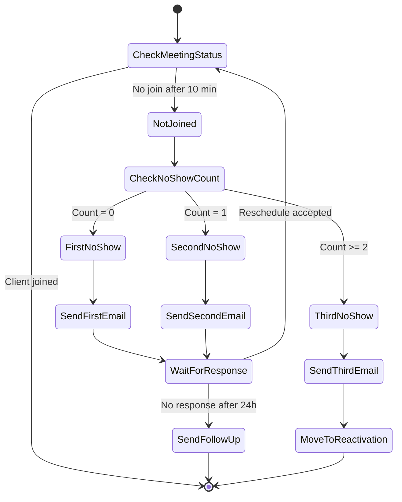

# Meeting No-Show Handler - Agent Specification

**Status:** Ready to Build
**Last Updated:** 2025-12-05
**Refined From:** plan/agents/meeting-no-show-handler.md

## Overview

The Meeting No-Show Handler agent automatically detects and handles missed meetings by:
- Detecting when a client doesn't join a scheduled meeting within 10 minutes
- Sending personalized follow-up emails with reschedule options
- Tracking no-show history to prevent repeat offenders
- Escalating chronic no-shows to a reactivation pool

The agent operates autonomously after meetings, requiring no human intervention except for template approval.

## Architecture



## Configuration

```python
from src.config import Settings

class NoShowHandlerConfig:
    # Timing thresholds
    NO_SHOW_THRESHOLD_MINUTES: int = 10
    FOLLOW_UP_HOURS: int = 24
    REACTIVATION_THRESHOLD: int = 3

    # Email settings
    EMAIL_RETRY_ATTEMPTS: int = 3
    EMAIL_RETRY_DELAY: int = 300  # 5 minutes
    EMAIL_TIMEOUT: int = 30

    # Rate limiting
    CAL_COM_RATE_LIMIT: int = 100  # requests per hour
    EMAIL_RATE_LIMIT: int = 10  # per minute

    # Model settings
    MODEL_NAME: str = "claude-sonnet-4-20250514"
    MAX_TOKENS: int = 4096
    TEMPERATURE: float = 0.3  # Lower for consistent behavior
```

## Database Schema

```sql
-- Track all no-show events
CREATE TABLE no_show_logs (
    id UUID PRIMARY KEY DEFAULT gen_random_uuid(),
    meeting_id UUID NOT NULL REFERENCES meetings(id),
    client_id UUID NOT NULL REFERENCES clients(id),
    no_show_number INTEGER NOT NULL,  -- 1st, 2nd, 3rd no-show
    scheduled_at TIMESTAMP WITH TIME ZONE NOT NULL,
    detected_at TIMESTAMP WITH TIME ZONE DEFAULT NOW(),
    email_sent_at TIMESTAMP WITH TIME ZONE,
    follow_up_sent_at TIMESTAMP WITH TIME ZONE,
    reschedule_link VARCHAR(2048),
    status VARCHAR(50) NOT NULL DEFAULT 'pending',
    created_at TIMESTAMP WITH TIME ZONE DEFAULT NOW(),

    CONSTRAINT valid_status CHECK (status IN ('pending', 'email_sent', 'follow_up_sent', 'rescheduled', 'reactivated')),
    CONSTRAINT positive_no_show CHECK (no_show_number > 0)
);

-- Track reschedule attempts
CREATE TABLE reschedule_attempts (
    id UUID PRIMARY KEY DEFAULT gen_random_uuid(),
    no_show_log_id UUID NOT NULL REFERENCES no_show_logs(id),
    attempt_number INTEGER NOT NULL,
    reschedule_link VARCHAR(2048) NOT NULL,
    expires_at TIMESTAMP WITH TIME ZONE NOT NULL,
    clicked_at TIMESTAMP WITH TIME ZONE,
    new_meeting_id UUID REFERENCES meetings(id),
    status VARCHAR(50) NOT NULL DEFAULT 'sent',
    created_at TIMESTAMP WITH TIME ZONE DEFAULT NOW(),

    CONSTRAINT valid_reschedule_status CHECK (status IN ('sent', 'clicked', 'expired', 'booked')),
    CONSTRAINT positive_attempt CHECK (attempt_number > 0)
);

-- Clients in reactivation pool
CREATE TABLE reactivation_pool (
    id UUID PRIMARY KEY DEFAULT gen_random_uuid(),
    client_id UUID NOT NULL REFERENCES clients(id),
    no_show_count INTEGER NOT NULL,
    last_no_show_date TIMESTAMP WITH TIME ZONE NOT NULL,
    reactivate_at TIMESTAMP WITH TIME ZONE,
    status VARCHAR(50) NOT NULL DEFAULT 'pending',
    notes TEXT,
    created_at TIMESTAMP WITH TIME ZONE DEFAULT NOW(),
    updated_at TIMESTAMP WITH TIME ZONE DEFAULT NOW(),

    CONSTRAINT valid_reactivation_status CHECK (status IN ('pending', 'contacted', 'reactivated', 'closed')),
    CONSTRAINT positive_count CHECK (no_show_count >= 0)
);

-- Indexes for performance
CREATE INDEX idx_no_show_logs_client_meeting ON no_show_logs(client_id, meeting_id);
CREATE INDEX idx_no_show_logs_status ON no_show_logs(status);
CREATE INDEX idx_reschedule_attempts_log_id ON reschedule_attempts(no_show_log_id);
CREATE INDEX idx_reactivation_pool_client ON reactivation_pool(client_id);
CREATE INDEX idx_reactivation_pool_status ON reactivation_pool(status);
```

## Tools

### Tool: check_meeting_attendance
**Purpose:** Check if a client has joined a scheduled meeting

**Input Schema:**
```python
from pydantic import BaseModel, Field
from typing import Optional
from datetime import datetime

class CheckAttendanceInput(BaseModel):
    meeting_id: str = Field(..., description="Unique identifier for the meeting")
    video_platform: str = Field(..., description="Platform: 'zoom', 'google_meet', 'teams'")
    host_email: str = Field(..., description="Host's email for API access")
    start_time: datetime = Field(..., description="Meeting start time")
    grace_period_minutes: int = Field(default=10, description="Minutes to wait after start")

class CheckAttendanceOutput(BaseModel):
    meeting_id: str
    has_joined: bool
    joined_at: Optional[datetime]
    participants: list[dict]
    status: str  # 'not_started', 'in_progress', 'ended', 'not_joined'
    check_time: datetime
```

**Error Handling:**
- API auth error → Fail immediately, alert ops
- Rate limit → Exponential backoff, max 5 retries
- Invalid meeting ID → Log and mark as not joined
- Network timeout → Retry 3x with longer timeout
- Platform unavailable → Graceful degradation, assume not joined

**Example:**
```python
# Input
{
    "meeting_id": "zoom-123-456-789",
    "video_platform": "zoom",
    "host_email": "host@company.com",
    "start_time": "2025-12-05T14:00:00Z"
}

# Output
{
    "meeting_id": "zoom-123-456-789",
    "has_joined": False,
    "joined_at": None,
    "participants": [],
    "status": "not_joined",
    "check_time": "2025-12-05T14:10:00Z"
}
```

### Tool: get_no_show_history
**Purpose:** Retrieve client's no-show history

**Input Schema:**
```python
class GetHistoryInput(BaseModel):
    client_id: str = Field(..., description="Client identifier")
    meeting_id: Optional[str] = Field(None, description="Specific meeting to check")

class GetHistoryOutput(BaseModel):
    client_id: str
    total_no_shows: int
    recent_no_shows: list[dict]
    is_in_reactivation_pool: bool
    last_no_show_date: Optional[datetime]
```

**Error Handling:**
- Database connection error → Retry 3x, then fail
- Invalid client_id → Return empty history with warning
- Query timeout → Retry with longer timeout
- Constraint violation → Log error and return partial data

### Tool: send_no_show_email
**Purpose:** Send personalized no-show email with reschedule link

**Input Schema:**
```python
class SendEmailInput(BaseModel):
    client_id: str = Field(..., description="Client identifier")
    client_email: str = Field(..., description="Client's email address")
    first_name: str = Field(..., description="Client's first name")
    meeting_time: datetime = Field(..., description="Missed meeting time")
    no_show_number: int = Field(..., description="1st, 2nd, or 3rd no-show")
    reschedule_link: str = Field(..., description="Cal.com reschedule URL")
    template_name: str = Field(..., description="Template: 'first', 'second', or 'third'")

class SendEmailOutput(BaseModel):
    email_id: str
    status: str  # 'sent', 'failed', 'retrying'
    sent_at: datetime
    delivery_estimated: datetime
```

**Error Handling:**
- Email provider rate limit (429) → Exponential backoff, max 3 retries
- Invalid email address → Log error, mark as failed
- Template not found → Use default template, alert ops
- Send timeout → Retry once with longer timeout
- Bounce/complaint → Mark email as invalid, update client status

### Tool: generate_reschedule_link
**Purpose:** Generate personalized reschedule link via Cal.com

**Input Schema:**
```python
class GenerateLinkInput(BaseModel):
    client_email: str = Field(..., description="Client's email")
    event_type_id: Optional[str] = Field(None, description="Specific Cal.com event type")
    custom_availability: Optional[dict] = Field(None, description="Override availability")
    expires_hours: int = Field(default=72, description="Link expiration in hours")

class GenerateLinkOutput(BaseModel):
    reschedule_link: str
    expires_at: datetime
    available_slots: list[dict]
    link_id: str
```

**Error Handling:**
- Cal.com API error → Retry 3x, then use generic link
- Rate limit → Wait and retry once
- Invalid client_email → Generate link without email prefill
- Event type not found → Use default event type
- Network error → Log and return None

### Tool: update_no_show_record
**Purpose:** Update no-show record with new information

**Input Schema:**
```python
class UpdateRecordInput(BaseModel):
    no_show_log_id: str = Field(..., description="No-show record ID")
    status: str = Field(..., description="New status")
    email_sent_at: Optional[datetime] = Field(None)
    follow_up_sent_at: Optional[datetime] = Field(None)
    notes: Optional[str] = Field(None)

class UpdateRecordOutput(BaseModel):
    success: bool
    record_id: str
    updated_fields: list[str]
```

**Error Handling:**
- Record not found → Create new record with warning
- Database constraint violation → Log full error, fail gracefully
- Connection timeout → Retry 3x, escalate if persistent
- Invalid status → Return validation error

### Tool: move_to_reactivation_pool
**Purpose:** Move chronic no-show clients to reactivation pool

**Input Schema:**
```python
class MoveToReactivationInput(BaseModel):
    client_id: str = Field(..., description="Client identifier")
    no_show_count: int = Field(..., description="Total no-show count")
    last_meeting_id: str = Field(..., description="Last missed meeting")
    reactivate_after_days: int = Field(default=30, description="Days to wait before reactivation")

class MoveToReactivationOutput(BaseModel):
    reactivation_id: str
    reactivate_at: datetime
    pool_size: int
```

**Error Handling:**
- Client already in pool → Update existing record
- Database error → Retry 3x, alert if persistent
- Invalid reactivate_after_days → Use default (30 days)

## Prompts

### System Prompt
```
You are the Meeting No-Show Handler, a professional and courteous agent that manages missed meetings automatically.

Your responsibilities:
- Detect when clients miss scheduled meetings (no join within 10 minutes)
- Send personalized follow-up emails with reschedule options
- Track no-show patterns to identify chronic issues
- Escalate repeat offenders to the reactivation pool

Your tone should be:
- Understanding and empathetic (people get busy)
- Professional but warm
- Brief and to the point
- Always offering a path forward

Guidelines:
- Never guilt or shame clients for missing meetings
- Make rescheduling as easy as possible
- Keep emails under 125 words for mobile readability
- Track all interactions for pattern analysis
- Respect communication preferences and frequency limits

When sending emails:
- Use the client's first name
- Reference the specific missed time
- Provide immediate reschedule options
- Keep a positive, forward-looking tone

When handling no-shows:
- First offense: Friendly check-in, easy reschedule
- Second offense: Still friendly, acknowledge scheduling challenges
- Third offense: Warm farewell, open door for future contact
```

### User Prompt Templates

#### Check Meeting Status
```
Task: Check if client joined meeting
Context:
- Meeting ID: {meeting_id}
- Scheduled for: {scheduled_time}
- Video platform: {video_platform}
- Client: {client_name} ({client_email})

Please verify if the client has joined the meeting.
Current time is {current_time}.

If they haven't joined yet, wait until {grace_period_minutes} minutes past start time before marking as no-show.
```

#### Process No-Show
```
Task: Handle no-show for meeting
Context:
- Client: {client_name} ({client_email})
- Meeting time: {meeting_time}
- No-show count: {no_show_count} of 3
- Meeting ID: {meeting_id}

Actions needed:
1. Send no-show email (template: {template_name})
2. Generate reschedule link
3. Update database record
4. Schedule 24-hour follow-up if needed

{no_show_count == 3 and "Also: Move client to reactivation pool" or ""}
```

#### Follow-Up Check
```
Task: Check for reschedule response
Context:
- No-show sent: {email_sent_at}
- Follow-up deadline: {follow_up_deadline}
- Client: {client_name}
- Original meeting: {meeting_time}

If no response to reschedule email:
- Send gentle follow-up
- Keep door open for future contact
- Do not pressure or guilt

If reschedule accepted:
- Update status to 'rescheduled'
- Note new meeting details
- Close no-show loop
```

## Error Handling Matrix

| Stage | Error Type | Detection | Response | Retry |
|-------|------------|-----------|----------|-------|
| Attendance Check | API auth failure | 401/403 | Fail immediately, alert ops | No |
| Attendance Check | Rate limit | 429 | Exponential backoff | Yes, 5 attempts |
| Attendance Check | Invalid meeting | API error | Log, assume not joined | No |
| Email Send | Provider rate limit | 429 | Backoff, retry later | Yes, 3 attempts |
| Email Send | Invalid email | Bounce | Mark email invalid | No |
| Email Send | Template error | Exception | Use default template | No |
| Reschedule Link | Cal.com error | API failure | Use generic link | Yes, 2 attempts |
| Database | Connection error | Exception | Retry with backoff | Yes, 3 attempts |
| Database | Constraint violation | DB error | Log, continue | No |
| General | Timeout | Exception | Retry with longer timeout | Yes, 2 attempts |

### Recovery Strategies

1. **Graceful Degradation**: If video platform API fails, assume no-show after grace period
2. **Fallback Email**: Use generic template if personalization fails
3. **Offline Mode**: Queue actions if database unavailable, process when back
4. **Partial Success**: Log what worked, continue with next steps
5. **User Notification**: Only alert ops for critical failures, not client issues

## Multi-Agent Integration

### Handoffs From:
- **Meeting Scheduler Agent**: Provides meeting data when created
  - Trigger: Meeting scheduled
  - Payload: `{meeting_id, client_id, scheduled_time, video_platform}`

### Handoffs To:
- **Meeting Scheduler Agent**: When client reschedules
  - Trigger: Reschedule link clicked
  - Payload: `{client_id, new_meeting_time, original_meeting_id}`

- **Client Success Agent**: For chronic no-shows
  - Trigger: Third no-show detected
  - Payload: `{client_id, no_show_history, risk_assessment}`

- **Reactivation Agent**: When moving to reactivation pool
  - Trigger: Reactivation due
  - Payload: `{client_id, last_contact, recommended_approach}`

## Testing Strategy

### Unit Tests

```python
# Tool validation tests
def test_check_attendance_invalid_meeting():
    """Verify graceful handling of invalid meeting IDs"""

def test_send_email_rate_limit():
    """Verify exponential backoff on rate limit"""

def test_generate_reschedule_link_fallback():
    """Verify fallback when Cal.com unavailable"""

def test_update_record_not_found():
    """Verify creation of new record when ID not found"""

# Business logic tests
def test_first_no_show_flow():
    """Verify complete first no-show handling flow"""

def test_second_no_show_different_template():
    """Verify second no-show uses different template"""

def test_third_no_show_reactivation():
    """Verify third no-show triggers reactivation"""

def test_reschedule_within_24h():
    """Verify early reschedule cancels follow-up"""

def test_concurrent_meeting_check():
    """Verify no duplicate no-show processing"
```

### Integration Tests

```python
def test_end_to_end_zoom_integration():
    """Test with Zoom API (sandbox environment)"""

def test_email_provider_integration():
    """Test with actual email service (test mode)"""

def test_cal_com_reschedule_flow():
    """Test Cal.com link generation and callback"""

def test_database_transaction_rollback():
    """Verify atomic operations roll back on failure"""

def test_agent_handoff_to_scheduler():
    """Test handoff when client reschedules"""
```

### Mock Strategy

```python
@pytest.fixture
def mock_zoom_client():
    """Mock Zoom API client"""
    with patch('src.integrations.zoom.ZoomClient') as mock:
        mock.return_value.get_meeting_participants.return_value = []
        yield mock

@pytest.fixture
def mock_email_sender():
    """Mock email sending service"""
    with patch('src.integrations.email.EmailClient') as mock:
        mock.return_value.send.return_value = {"message_id": "test-123"}
        yield mock

@pytest.fixture
def mock_cal_com():
    """Mock Cal.com API"""
    with patch('src.integrations.cal_com.CalComClient') as mock:
        mock.return_value.create_reschedule_link.return_value = {
            "link": "https://cal.com/reschedule/abc123",
            "expires_at": "2025-12-08T14:00:00Z"
        }
        yield mock
```

## Performance

### Expected Latency
- Meeting attendance check: 2-5 seconds
- Email generation and send: 1-3 seconds
- Reschedule link generation: 1-2 seconds
- Database updates: <500ms
- Total no-show processing: 5-10 seconds

### Token Usage
- System prompt: ~500 tokens
- User prompt (context): ~200 tokens
- Email generation: ~300 tokens
- Total per no-show: ~1,000 tokens

### Caching Strategy
- Cache client no-show history (5 minutes)
- Cache email templates (in-memory)
- Cache Cal.com event types (1 hour)
- Cache meeting platform auth tokens (until expiry)

## Observability

### Logging Requirements
```python
# Structured logging with context
logger.info(
    "Processing no-show",
    extra={
        "meeting_id": meeting_id,
        "client_id": client_id,
        "no_show_count": count,
        "processing_time_ms": elapsed,
        "status": "processing"
    }
)

# Error logging with full context
logger.error(
    "Failed to send no-show email",
    extra={
        "meeting_id": meeting_id,
        "client_id": client_id,
        "email_provider": "sendgrid",
        "error_code": "rate_limit",
        "retry_count": 2,
        "exception": str(e)
    },
    exc_info=True
)
```

### Metrics to Track
- No-show rate per client/segment
- Email delivery success rate
- Reschedule conversion rate
- Time to reschedule after no-show
- Reactivation pool size and conversion
- Agent processing latency
- Error rates by integration

### Alerts
- No-show rate > 30% for any segment
- Email delivery failure rate > 5%
- Cal.com API failure rate > 10%
- Database connection failures
- Agent processing errors > 1% of tasks

## Security

### API Key Management
- Store all API keys in environment variables
- Rotate Cal.com keys monthly
- Use email provider API keys with minimal permissions
- Log all API key usage for audit

### Data Protection
- Hash client emails in logs
- Encrypt sensitive data in database
- Never store video platform passwords
- Sanitize all inputs before processing

### Access Control
- Restrict meeting platform access to specific hosts
- Validate all webhook signatures
- Rate limit all external API calls
- Implement IP whitelisting where possible

## Acceptance Criteria

- [ ] Detects no-shows 10 minutes after meeting start time
- [ ] Sends appropriate email template based on no-show count
- [ ] Generates working reschedule links via Cal.com
- [ ] Accurately tracks no-show history per client
- [ ] Sends 24-hour follow-up when no response to reschedule
- [ ] Moves clients to reactivation pool after 3 no-shows
- [ ] Prevents duplicate no-show processing
- [ ] Handles all integration failures gracefully
- [ ] Logs all actions with sufficient detail for debugging
- [ ] Meets performance requirements (<10s processing)
- [ ] Passes all unit and integration tests
- [ ] Handles edge cases (invalid emails, API failures, etc.)
- [ ] Maintains professional, empathetic tone in all communications
